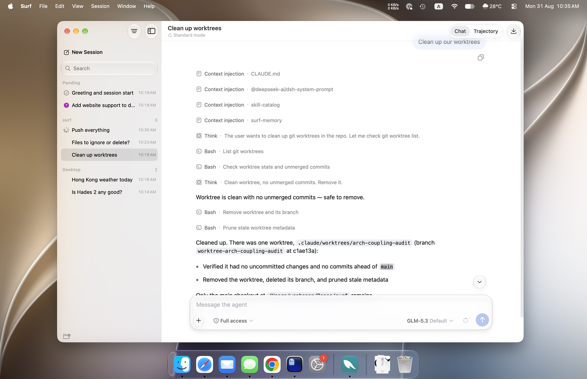

# Surf

<p>
  <a href="README.md"></a>
  <a href="https://github.com/wbopan/surf/releases/latest"></a>
  <a href="LICENSE"></a>
</p>

[dsh](https://github.com/deepseek-ai/deepseek-harness)（DeepSeek Harness）是 DeepSeek 的编码助手，
自带一个在浏览器里打开的 Web 界面。Surf 把这个界面装进一扇 Mac 窗口，配上原生的会话边栏、
系统通知、独立的设置窗口和完整的菜单与快捷键。会话、模型、工具仍然跑在 dsh 那一侧。



官网：<https://wbopan.github.io/surf/>

## 安装

需要 macOS 27 或更高版本，以及 dsh：

```sh
npm i -g @deepseek-ai/dsh@0.1.1-rc.2
```

然后从 [Releases](https://github.com/wbopan/surf/releases/latest) 下载 `Surf-<版本>.dmg`，
把里面的 Surf 拖进「应用程序」，双击。应用自己启动一个 dsh 后端，打开即有，⌘Q 一并退出。
不需要 Xcode，也不需要其它构建工具。

dsh 版本是钉住的。它处于 developer preview，明示会有 breaking change，
换成别的版本后界面可能错位或缺一块。当前验证于 `0.1.1-rc.2`。

连接偏好、诊断面板、日志位置、升级与卸载都在 [`docs/use/install.md`](docs/use/install.md)。

## 它不是什么

Surf 是 dsh 的壳。功能、数据、设置的真相都在 dsh 那边，原生这一侧只做投影，
主题、界面语言、会话分组一概跟随。

上游没实现的东西我们不替它补，也不绕过公开 API 自己实现。已知缺口逐条记在
[`docs/internals/dsh-upstream-gaps.md`](docs/internals/dsh-upstream-gaps.md)。

## 开发

前置：macOS 27+、完整的 Xcode（`xcodebuild` 要它，Command Line Tools 不够）、
Node `^22.19.0 || >=24.0.0`、xcodegen（`brew install xcodegen`，或让 `./dev` 从 PATH 上拷一份）。

仓库克隆到哪里都行，跑一行：

```sh
./dev              # 装好依赖并前台起 dsh，端口交给系统挑
./dev --port 3080  # 想要固定端口时
```

`./dev` 幂等，随便重复跑。首次会构建壳，之后源码没变就秒起。窗口没弹出来就看终端，
`surf-app:` 开头那几行会说清卡在哪。

想让这台机器上随时双击就能用：

```sh
./release             # Release 壳装进 /Applications，装完打开一次
./release --status    # 后端与 App 各在什么状态
./release --uninstall # 删掉 App，会话与设置不动
```

改动分三个循环，快慢差两个数量级：

| 改什么 | 怎么生效 | 耗时 |
|---|---|---|
| 插件的 `swift/` | 存盘即可。桥轮询发现 → 壳重编 → 世代热替换 | 1~3s，不重启任何东西 |
| 插件的 `lib/client.js` | 浏览器侧有 HMR，自动重载 | 秒级 |
| 插件的 `lib/*.js`、`package.json`、编排表 | 重启 dsh（dsh 在 web bundle 下关了 node 侧 HMR） | 秒级 |
| 壳源码 `surf-app/host/` | surf-app 盯着它，改了后台重建，窗口右上角提示「重启生效」 | 重建 2s + 重启 |

第一行是这个项目的重心。改 `surf-sidebar/swift/SidebarView.swift` 存盘，一两秒后侧边栏就变了，
选中态和列表内容都还在——数据面存在跨世代的保管箱里，换掉的只是代码。编译失败带文件行号
打进 dsh 终端，旧世代继续在役，界面不变也不崩。这套机制的实测结论与硬约束在
[`docs/internals/architecture.md`](docs/internals/architecture.md) §7-8 与
[`docs/extend/native-abi.md`](docs/extend/native-abi.md)。

测试：

```sh
node --test surf-sidebar/test/*.test.js surf-memory/test/*.test.js
```

## 写一个插件

外部作者不必读本仓库源码。一个带 Swift 载荷的插件，node 半边通常只有几行：

```js
import { createSwiftPlugin } from "@wenbo/surf-bridge/plugin";

export default createSwiftPlugin({
  name: "surf-sidebar",
  provide: "surf-sidebar",      // 空标记服务，供下游 inject
  inject: ["surf-layout"],      // cordis：layout 没挂好就不挂我
  swiftDir: new URL("../swift/", import.meta.url),
  swiftDeps: ["surf-layout"],   // 桥：上游换代时我自动跟着重编
});
```

Swift 半边导出一个 C 入口，拿到 `host` 就往槽里塞视图：

```swift
@_cdecl("surf_plugin_entry")
public func surf_plugin_entry() -> UnsafeMutableRawPointer {
    Unmanaged.passRetained(SidebarPlugin()).toOpaque()
}

final class SidebarPlugin: SurfPlugin {
    func activate(host: SurfHost) -> AnyObject? {
        let handle = SurfPluginHandle()
        host.register(slot: "sidebar") { AnyView(SidebarView(...)) }.kept(by: handle)
        return handle   // 壳松手 = 这一代退休，注册与订阅一并撤销
    }
}
```

数据面放在 node 半边是有意的：壳随 app bundle 冻结，node 半边随包可更新。
完整写法见 [`docs/extend/plugin-author-guide.md`](docs/extend/plugin-author-guide.md)。

## 仓库里都有什么

一组 [cordis](https://github.com/shigma/cordis) 插件，加一个极薄的 macOS 壳。
壳的源码、构建、拉起全都收在一个普通插件（`surf-app`）里，没有特权目录。

```
surf/          伞 bundle @wenbo/surf：本仓库唯一的编排表（cordis.patch.yml 决定
                   装哪些插件、什么顺序、什么配置），外加启动器 bin/surf.js
surf-app/          壳源码为载荷的插件：构建 + 写 endpoint 发现文件 + 拉起 App
  host/            Xcode 工程（project.yml / Sources/ / scripts/）
  host-build/      构建能力，不随包分发——正式形态的 App 因此天然不构建自己
surf-bridge/       唯一的特权插件：Swift 载荷登记表 + /surf/bridge WS + 盯 swift/ 目录
surf-layout/       占 root 槽：分栏、WebView 排版、sidebar 槽、开放的 toolbar 贡献槽
surf-sidebar/      占 sidebar 槽：原生会话侧边栏。数据面在 node 半边，Swift 只管画
surf-notify/       桌面通知：不占槽、不贡献界面，缺席即无通知。同时是「有什么在等着你」
                   的唯一真相，供给侧边栏的会话状态（缺席时退回只有「待批准」）
surf-settings/     原生设置窗口：不占槽、自己一扇窗，前四栏编排照抄 dsh 的 Web 设置对话框
surf-nativeify/    让 dsh Web UI 摸起来像原生 App：主力是 client 半边那段 CSS，
                   另有一个薄 Swift 载荷让原生侧跟随 dsh 的 ui-theme
surf-memory/       跨会话持久记忆：一目录 markdown，索引每步注入、正文按需读。
                   纯 node、零 macOS 依赖，装到任何一台有 dsh 的机器上都跑得动
tools/             跨包的开发工具。只服务一个插件的工具归那个插件
docs/              文档，按受众分四层，见下
site/              官网，纯静态，无构建步骤
```

## 文档

| 你是谁 | 从哪读起 |
|---|---|
| 想用它 | [`docs/use/install.md`](docs/use/install.md) |
| 想给它写插件 | [`docs/extend/plugin-author-guide.md`](docs/extend/plugin-author-guide.md) → [`docs/extend/contracts.md`](docs/extend/contracts.md) |
| 想改这个仓库 | [`docs/internals/`](docs/internals/) |

完整索引与每篇一句话说明在 [`docs/README.md`](docs/README.md)。

## 许可证

[MIT](LICENSE)。
